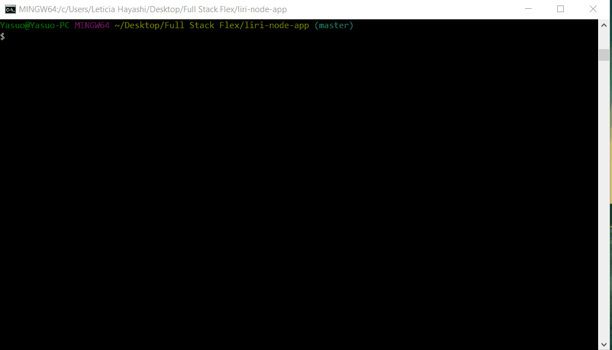
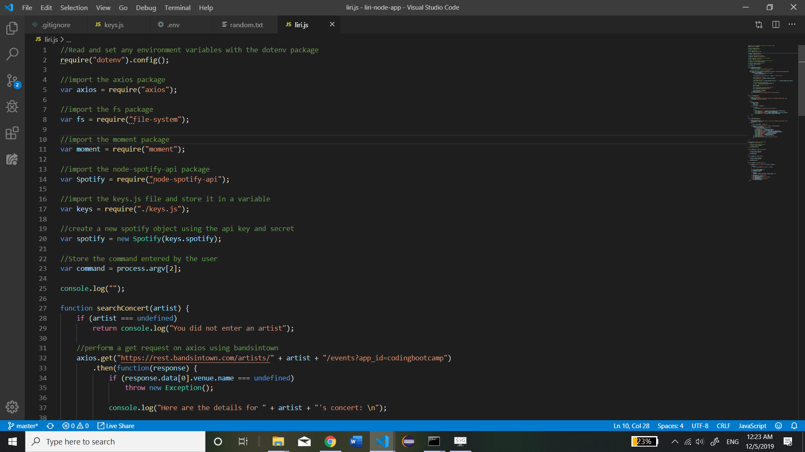
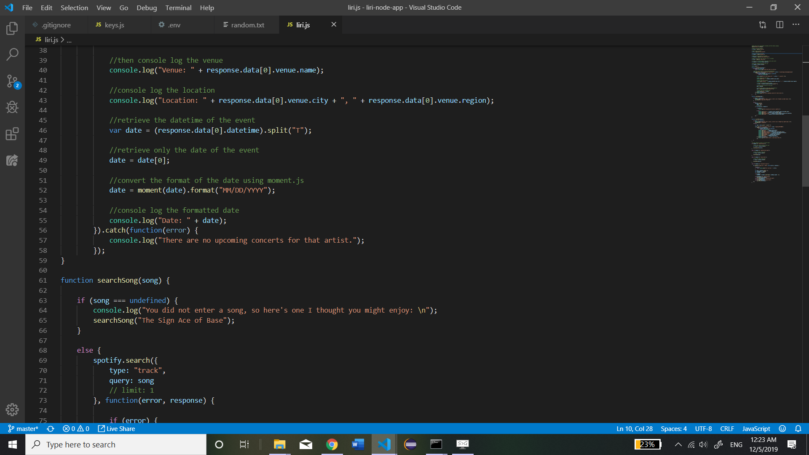
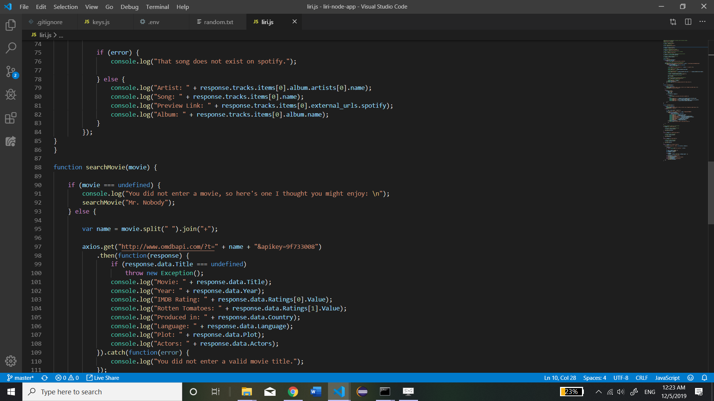
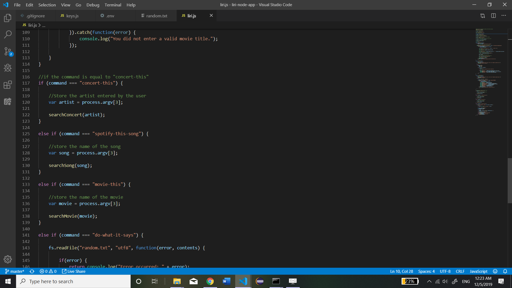
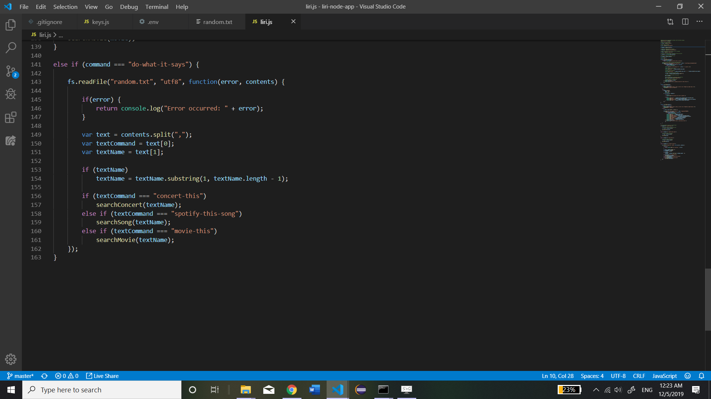
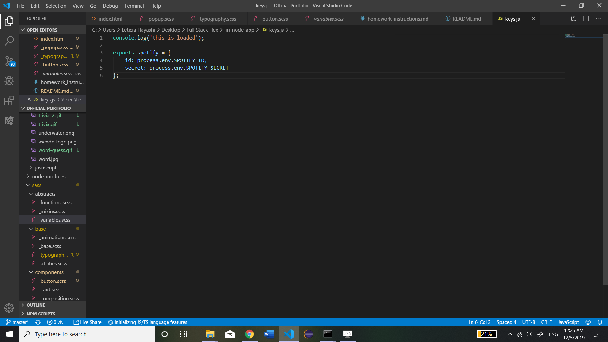
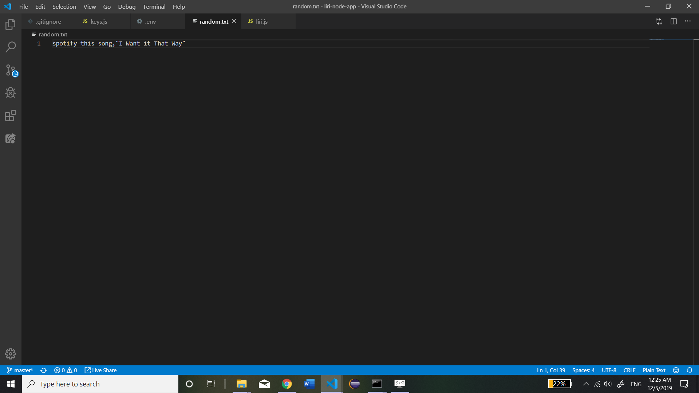

# liri-node-app

The Assignment: To design a node-based program that is similar to Siri. This app is called LIRI, Language Interpretation and Recognition Interface. The user will run the app using node giving it two parameters, a command and a name. Information based on the two parameters will be returned to the console. For example, the user can type in "node liri.js concert-this "Billie Eilish" and the time and location of the concert will be returned back to the user. LIRI has a total of 4 command (concert-this, spotify-this-song, movie-this, and do-what-it-says). Concert-this will return informastion about a concert. Spotify-this-song will return information about a movie. And do-what-it-says will read a file and perform the corresponding command on the parameter from that file.

How it works: When the user enters the two parameters in terminal, node will use a variety of APIs, along with the 'axios' npm package to retrieve that data. Concert-this will use axios to retrieve data from the BandsInTown API(Moment.js is also used for this command to format the date of the concert). Spotify-this-song will use axios to retrieve data from Spotify. And movie-this will do the same thing using the OMDB api. The second parameter given by the user will be used by the APIs to retrieve the relevant data. The do-what-it-says comand uses the 'fs' npm package to read the file and perform its corresponding command.

Demo:

Screenshots:

liri.js:
    
    
    
    
    

keys.js:
    

random.txt:
    